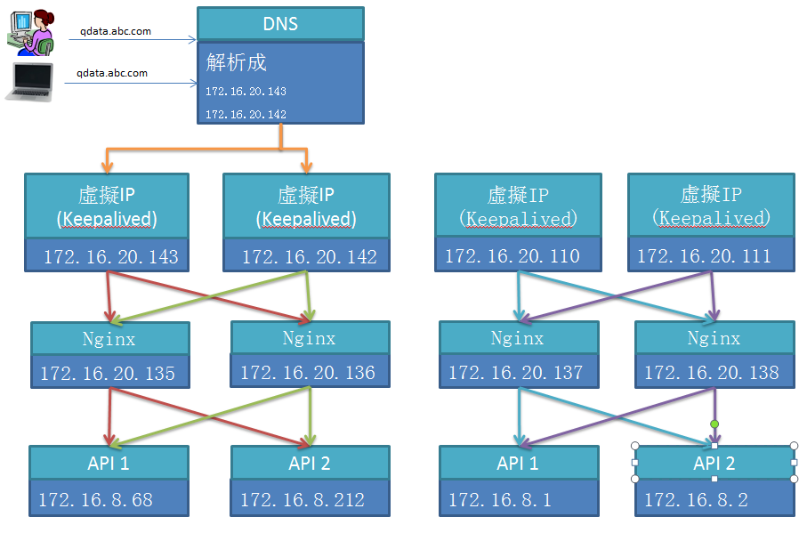

# nginx_keepalived


## Synopsis



## Code Example

無

## Motivation

proxy_pass 去掉後端的 PORT 號

## Installation
```sh
#已下設定 Master & Backup 主機都要做

#安裝 keepalived
yum -y install keepalived


#設定檔路徑
cd /etc/keepalived/
#nginx.sh 可參考上面
vim nginx.sh
chmod +x nginx.sh

cp keepalived.conf keepalived.conf.bak
vi keepalived.conf

#防火牆設定
firewall-cmd --direct --permanent --add-rule ipv4 filter INPUT 0 --in-interface ens160 --destination 224.0.0.18 --protocol vrrp -j ACCEPT
firewall-cmd --zone=public --add-port=80/tcp --permanent
firewall-cmd --zone=public --add-port=112/tcp --permanent
firewall-cmd --reload
 
setenforce 0 ##设置SELinux 成为permissive模式
##setenforce 1 设置SELinux 成为enforcing模式

systemctl start keepalived
systemctl restart keepalived

```

ip addr # 查看虚拟IP

```sh


#第一台
1: lo: <LOOPBACK,UP,LOWER_UP> mtu 65536 qdisc noqueue state UNKNOWN qlen 1
    link/loopback 00:00:00:00:00:00 brd 00:00:00:00:00:00
    inet 127.0.0.1/8 scope host lo
       valid_lft forever preferred_lft forever
    inet6 ::1/128 scope host 
       valid_lft forever preferred_lft forever
2: ens160: <BROADCAST,MULTICAST,UP,LOWER_UP> mtu 1500 qdisc mq state UP qlen 1000
    link/ether 00:50:56:a3:6e:3f brd ff:ff:ff:ff:ff:ff
    inet 172.16.20.138/24 brd 172.16.20.255 scope global ens160
       valid_lft forever preferred_lft forever
    inet 172.16.20.110/32 scope global ens160
       valid_lft forever preferred_lft forever
    inet6 fe80::250:56ff:fea3:6e3f/64 scope link 
       valid_lft forever preferred_lft forever
3: ens192: <NO-CARRIER,BROADCAST,MULTICAST,UP> mtu 1500 qdisc mq state DOWN qlen 1000
    link/ether 00:50:56:a3:42:a6 brd ff:ff:ff:ff:ff:ff
    inet 210.71.158.116/24 brd 210.71.158.255 scope global ens192
       valid_lft forever preferred_lft forever
    inet6 fe80::250:56ff:fea3:42a6/64 scope link 
       valid_lft forever preferred_lft forever
4: docker0: <NO-CARRIER,BROADCAST,MULTICAST,UP> mtu 1500 qdisc noqueue state DOWN 
    link/ether 02:42:05:00:b3:be brd ff:ff:ff:ff:ff:ff
    inet 172.17.0.1/16 scope global docker0
       valid_lft forever preferred_lft forever

```
```sh
#第二台
1: lo: <LOOPBACK,UP,LOWER_UP> mtu 65536 qdisc noqueue state UNKNOWN qlen 1
    link/loopback 00:00:00:00:00:00 brd 00:00:00:00:00:00
    inet 127.0.0.1/8 scope host lo
       valid_lft forever preferred_lft forever
    inet6 ::1/128 scope host 
       valid_lft forever preferred_lft forever
2: ens160: <BROADCAST,MULTICAST,UP,LOWER_UP> mtu 1500 qdisc mq state UP qlen 1000
    link/ether 00:50:56:a3:49:07 brd ff:ff:ff:ff:ff:ff
    inet 172.16.20.137/24 brd 172.16.20.255 scope global ens160
       valid_lft forever preferred_lft forever
    inet 172.16.20.111/32 scope global ens160
       valid_lft forever preferred_lft forever
    inet6 fe80::250:56ff:fea3:4907/64 scope link 
       valid_lft forever preferred_lft forever
3: ens192: <NO-CARRIER,BROADCAST,MULTICAST,UP> mtu 1500 qdisc mq state DOWN qlen 1000
    link/ether 00:50:56:a3:2d:f3 brd ff:ff:ff:ff:ff:ff
    inet 210.71.158.115/24 brd 210.71.158.255 scope global ens192
       valid_lft forever preferred_lft forever
    inet6 fe80::250:56ff:fea3:2df3/64 scope link 
       valid_lft forever preferred_lft forever
4: docker0: <NO-CARRIER,BROADCAST,MULTICAST,UP> mtu 1500 qdisc noqueue state DOWN 
    link/ether 02:42:ed:e4:0c:98 brd ff:ff:ff:ff:ff:ff
    inet 172.17.0.1/16 scope global docker0
       valid_lft forever preferred_lft forever
       
```


## API Reference

無

## Tests

打開瀏覽器: http://172.16.20.111  http://172.16.20.110  http://172.16.20.222  http://172.16.20.220 可以看到畫面</br>
到其中一台主機執行:  systemctl stop keepalived</br>
再打開瀏覽器: http://172.16.20.111  http://172.16.20.110  http://172.16.20.222  http://172.16.20.220  一樣可以看到畫面</br>
</br>
查看 log : tail -f /var/log/messages</br>

## Contributors

無

## License

無

## Others
